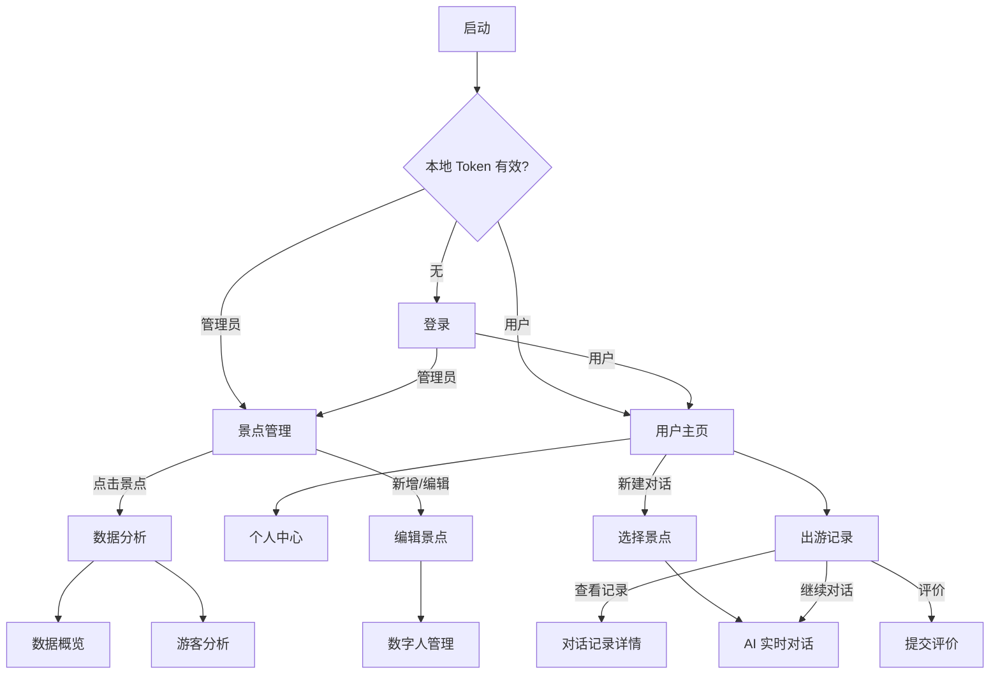

# AI 导游（DigitalTourGuide）功能需求文档

> **文档用途**：UI 重构交接。本文档只描述**业务功能与交互逻辑**，不约束现有界面样式、布局或组件形态。设计师可自由重新定义视觉与信息架构，但需覆盖下文所列功能点。  
> **平台**：原生 Android  
> **更新日期**：2026-06-06

---

## 一、产品定位

**AI 导游**是一款景区智能导览 App。游客通过 App 与景点的 AI 数字人进行实时语音、文字、视觉交互；景区管理员在后台配置景点信息、知识库、数字人形象，并查看运营数据分析。

### 两套独立角色体系

| 角色 | 核心任务链 |
|------|-----------|
| **普通用户（游客）** | 登录 → 浏览出游记录 → 选择景点 → AI 对话 → 评价 → 管理个人偏好 |
| **管理员** | 登录 → 管理景点列表 → 编辑景点/知识库/数字人 → 查看数据与游客分析 |

两套角色使用不同的登录凭证，登录后进入完全不同的主流程，互不交叉。

---

## 二、全局系统能力

设计时需预留以下横切能力，不限定呈现方式。

### 2.1 认证

- 用户 Token 与管理员 Token 分开存储，有效期 **7 天**
- 启动时根据本地 Token 自动判断进入哪个角色主页，或跳转登录
- 所有 API 请求自动携带 `Authorization: Bearer {token}`
- Token 失效（401）时应跳转登录页（全局拦截）

### 2.2 所需系统权限

| 权限 | 使用场景 |
|------|----------|
| 网络 | 全部接口 |
| 麦克风 | AI 实时对话 — 语音输入 |
| 相机 | AI 实时对话 — 拍照识景、自动发帧 |
| 读取图片/相册 | 用户头像上传、景点封面上传 |

权限被拒时，需有引导用户前往系统设置的流程（至少对话页需要）。

### 2.3 景点类型枚举（用户端与管理端共用）

共 8 类，用于筛选：

| type 值 | 类型名称 |
|---------|----------|
| 0 | 主题乐园 |
| 1 | 博物馆与展馆 |
| 2 | 自然公园 |
| 3 | 风景名胜 |
| 4 | 历史文化 |
| 5 | 古镇水乡 |
| 6 | 动植物园 |
| 7 | 现代地标 |
| null | 全部（不筛选） |

### 2.4 分页模式

列表类接口统一使用游标分页：

- 参数：`lastId`（上一页最后一条 ID）、`pageSize`
- 响应：`list`、`nextLastId`、`hasMore`
- 交互：滚动至列表底部时自动加载下一页

---

## 三、功能流转总览



---

## 四、公共模块

### 4.1 启动页

**功能目的**：应用入口，完成自动鉴权路由。

| 功能点 | 说明 |
|--------|------|
| 品牌展示 | 短暂展示（约 1 秒），无用户操作 |
| 自动路由 | 读取本地 Token 与上次登录角色，跳转对应主页或登录页 |

**路由规则**（按优先级）：
1. 上次登录为管理员 且 admin Token 有效 → 景点管理
2. 上次登录为用户 且 user Token 有效 → 用户主页
3. 仅 admin Token 有效 → 景点管理
4. 仅 user Token 有效 → 用户主页
5. 均无效 → 登录页

**需设计的状态**：加载中（短暂）

---

### 4.2 登录页

**功能目的**：同一入口支持普通用户与管理员两种角色登录。

| 功能点 | 说明 |
|--------|------|
| 角色切换 | 在「普通用户」与「管理员」之间切换，展示对应登录表单 |
| 用户登录 | 账号 + 密码登录 |
| 管理员登录 | 账号 + 密码登录 |
| 跳转注册 | 分别进入用户注册 / 管理员注册 |
| 密码可见性 | 支持显示/隐藏密码 |
| 注册回跳 | 注册成功后回到登录页，并预填账号 |

**用户登录 — 接口**：`POST users/login`  
**请求字段**：`username`、`password`  
**成功保存**：user token、userId、last_login_type=user  
**成功跳转**：用户主页

**管理员登录 — 接口**：`POST admins/login`  
**成功保存**：admin token、adminId、last_login_type=admin  
**成功跳转**：景点管理

**校验规则**：
- 账号、密码不能为空
- 接口返回 `code != 1` 时展示错误信息
- 网络异常需提示

**需设计的状态**：默认、提交中、账号/密码错误、网络错误

---

### 4.3 用户注册

**功能目的**：创建普通用户账号。

| 功能点 | 说明 |
|--------|------|
| 填写信息 | 昵称、账号、密码、确认密码 |
| 提交注册 | 调用注册接口 |

**接口**：`POST users/register`  
**请求字段**：`username`、`password`、`confirmPassword`、`nickname`

**校验规则**：
- 四项均不能为空
- 成功 → 跳转登录页，携带账号，角色=用户

---

### 4.4 管理员注册

**功能目的**：创建管理员账号。

| 功能点 | 说明 |
|--------|------|
| 填写信息 | 昵称、账号、密码、确认密码 |
| 提交注册 | 调用注册接口 |

**接口**：`POST admins/register`  
**请求字段**：同用户注册

**校验规则**：
- 用户名、密码、昵称不能为空（当前代码未强制校验确认密码，重构时建议补上）
- 成功 → 跳转登录页，角色=管理员

---

## 五、普通用户端

### 5.1 用户主页（容器页）

**功能目的**：用户登录后的主框架，承载两个子模块，并提供全局「新建对话」入口。

| 功能点 | 说明 |
|--------|------|
| 模块切换 | 「出游记录」与「个人中心」两个主模块 |
| 新建对话 | 全局快捷入口，行为因当前模块而异（见下） |
| 深链入参 | 支持直接打开指定模块（出游记录 / 个人中心） |

**新建对话行为**：
- 在「出游记录」模块：打开「选择景点」流程，选定后进入 AI 对话
- 在「个人中心」模块：当前代码直接进入 AI 对话但未传景点 ID（**已知缺陷，重构时应统一为选景点流程**）

**需设计的状态**：两个 Tab/模块的选中态

---

### 5.2 出游记录

**功能目的**：展示用户历史出游与 AI 对话记录，支持检索、筛选、继续对话、评价与删除。

#### 需展示的数据（每条记录）

| 字段 | 说明 |
|------|------|
| `id` | 出游记录 ID（删除用） |
| `attractionName` | 景点名称 |
| `coverUrl` | 景点封面图 |
| `conversationId` | 关联的会话 ID |
| 对话状态 | 进行中 / 已结束 / 已评价（由本地 `ended` 标记 + 本地已评价集合共同决定） |

#### 需支持的操作

| 操作 | 行为 |
|------|------|
| 关键词搜索 | 按景点名搜索，重置列表 |
| 类型筛选 | 按 8 类景点类型筛选，支持「全部」 |
| 滚动加载 | 分页加载，每页 10 条 |
| 点击记录 | 进入「对话记录详情」（传 `conversationId`） |
| 继续对话 | 进入 AI 对话（传 `attractionId` + `conversationId`） |
| 结束对话 | **仅本地标记为已结束**，无后端接口；结束后展示评价入口 |
| 评价 | 打开评价流程（见 5.7） |
| 长按删除 | 二次确认后删除出游记录 + 关联聊天记录 |
| 新建对话 | 打开「选择景点」流程 |

**接口**：
- 列表：`GET users/tourHistory?keyWord&type&lastId&pageSize=10`
- 删除记录：`DELETE users/tourHistory/delete/{id}`
- 删除聊天：`DELETE users/chat-history/{conversationId}`
- 评价：`POST users/tourHistory/evaluate`

#### 记录状态机

```
进行中 ──[结束对话]──► 已结束（可评价）
已结束 ──[提交评价]──► 已评价（不可再评）
```

**状态判断逻辑**：
- 进行中：未 `ended` 且本地未标记已评价 → 显示「结束」「继续对话」
- 已结束待评价：`ended=true` 且未评价 → 显示「评价」
- 已评价：本地 `rated_conversations` 包含该 `conversationId` → 显示「已评价」并禁用

**需设计的状态**：加载中、空列表、搜索无结果、加载更多、删除确认、评价弹窗

---

### 5.3 选择景点（新建对话）

**功能目的**：搜索并选择一个景点，开启新的 AI 对话会话。

| 功能点 | 说明 |
|--------|------|
| 关键词搜索 | 实时或按钮触发，重置列表 |
| 景点列表 | 展示可选景点（名称、封面等） |
| 分页加载 | 每页 10 条，滚动加载更多 |
| 选择景点 | 进入 AI 对话，仅传 `attractionId`（新会话，无 `conversationId`） |

**接口**：`GET users/attractions?keyword&lastId&pageSize=10`

**展示字段**：景点 ID、名称、封面 URL

**需设计的状态**：加载中、空列表、搜索无结果、选择中

> 呈现形式不限（全屏页、底部抽屉、弹窗均可），功能需完整。

---

### 5.4 AI 实时对话 ⭐ 核心页

**功能目的**：与指定景点的 AI 数字人进行实时多模态交互。

#### 入参

| 参数 | 必填 | 说明 |
|------|------|------|
| `attractionId` | 是 | 景点 ID，决定连接哪个数字人 |
| `conversationId` | 否 | 有值=恢复已有对话；无值=新建对话 |

#### 需支持的多模态交互

| 模态 | 功能 |
|------|------|
| **语音输入** | 点击麦克风录音，PCM 16kHz 单声道实时上行；录音前若 AI 正在说话则先打断 |
| **文字输入** | 输入文字并发送；非空校验 |
| **视觉输入** | 开启相机后每 1.5 秒自动发送画面帧；也可手动拍照；服务端可主动请求一帧（`requestPhoto`） |
| **数字人输出** | 接收并播放下行音频（PCM）+ 视频（JPEG 帧），同步渲染数字人画面 |
| **字幕** | 实时展示 AI 回复文字，支持开关 |
| **打断** | 用户新输入或录音时，打断 AI 当前播放 |

#### WebSocket 协议

- 地址：`wss://ai.guying.xyz/ai-project/chat?attractionId={id}`
- 需携带用户 Token

**上行消息类型**：

| type | 内容 |
|------|------|
| `text` | 文字消息 |
| `photo` | Base64 图片（1280×720 JPEG 80%） |
| `camera` | `status: on/off` |
| `micOn` / `misOff` | 麦克风开关 |
| `interrupt` | 打断 AI |
| `ping` | 心跳（每 10 秒） |

**下行消息类型**：

| type | 含义 |
|------|------|
| `ready` | 连接就绪 |
| `requestPhoto` | 服务端请求拍照 |
| `speechStarted` | AI 开始说话 |
| `userInput` | 用户输入回显 |
| `aiOutput` | AI 文字流（用于字幕） |
| `aiHuman` | 数字人状态 |
| `responseDone` / `allDone` / `done` | 回复完成 |
| `pong` | 心跳响应 |
| `error` | 错误 |
| 二进制 `0x01` | 音频 PCM 数据 |
| 二进制 `0x02` | 视频 JPEG 帧（含 sentenceId、pts） |

#### 其他功能点

| 功能点 | 说明 |
|--------|------|
| 相机关闭 | 页面暂停时停止自动发帧 |
| 资源释放 | 页面销毁时断开 WebSocket、释放录音/播放/相机 |
| 权限引导 | 麦克风/相机被拒时提示并引导去系统设置 |

**需设计的状态**（重要）：
- WebSocket：连接中 / 已连接 / 断开 / 错误
- 对话：空闲 / 用户录音中 / AI 回复中 / 等待用户输入
- 字幕：开 / 关
- 相机：开 / 关 / 预览中
- 数字人：加载中 / 播放中 / 静止
- 权限：未授权 / 已拒绝需引导

> 本页 UI 可完全重新设计，但需容纳上述多模态能力，并保证沉浸感与操作可达性。

---

### 5.5 对话记录详情

**功能目的**：只读查看某次会话的完整历史消息。

| 功能点 | 说明 |
|--------|------|
| 消息列表 | 按时间展示用户与 AI 的消息 |
| 角色区分 | `role=user` 为用户消息，`role=assistant` 为 AI 消息 |
| 继续对话 | 携带 `conversationId` 进入 AI 实时对话 |

**接口**：`GET users/chat-history/{conversationId}`

**消息字段**：`role`、`content`

**校验**：
- 缺少 `conversationId` → 提示并关闭页面
- 未登录 → 提示
- 无数据 → 展示空状态

**需设计的状态**：加载中、空记录、消息列表、加载失败

---

### 5.6 个人中心

**功能目的**：查看和编辑用户资料，配置 AI 个性化偏好，退出登录。

#### 需展示/编辑的字段

| 字段 | 类型 | 说明 |
|------|------|------|
| `avatarUrl` | 图片 | 用户头像，可更换 |
| `nickname` | 文本 | 昵称，1~20 字符 |
| `age` | 数字 | 年龄 |
| `gender` | 枚举 | 0=女，1=男，2=保密 |
| `userSetting` | 长文本 | AI 个性化偏好描述，最多 100 字 |

#### 需支持的操作

| 操作 | 说明 |
|------|------|
| 更换头像 | 从相册选图 → 上传 → 更新资料 |
| 编辑昵称 | 弹窗或内联编辑，1~20 字符 |
| 编辑年龄 | 弹窗或内联编辑 |
| 选择性别 | 男 / 女 / 保密 |
| 偏好标签 | 预设标签可点击插入到 `userSetting`，去重，总长 ≤100 |
| 保存偏好 | `userSetting` 不能为空 |
| 退出登录 | 跳转登录页（**当前代码未清除 Token，重构时建议补上**） |
| 新建对话 | 快捷进入 AI 对话（应统一为选景点流程） |

**接口**：
- 读取：`GET users/userInfo`
- 更新：`PUT users`（nickname, age, gender, userSetting, avatarUrl）
- 头像上传：`POST users/file/avatar`（multipart）

**需设计的状态**：加载中、编辑中、保存中、保存成功/失败、字数计数（x/100）

---

### 5.7 评价（子流程）

**功能目的**：用户对已结束的出游体验进行评分和文字反馈。

| 功能点 | 说明 |
|--------|------|
| 星级评分 | 1~5 星，必填 |
| 文字反馈 | 选填，最多 200 字 |
| 提交 | 调用评价接口 |

**接口**：`POST users/tourHistory/evaluate`  
**请求字段**：`conversationId`、`score`（1-5）、`feedback`

**校验**：
- 评分不能为 0
- 需已登录

**成功后**：本地标记该 `conversationId` 为已评价，刷新出游记录状态

**需设计的状态**：默认、未评分提交拦截、提交中、成功/失败

---

## 八、接口与数据字典速查

### 8.1 API 基址

- REST：`https://ai.guying.xyz/ai-project/v1/`
- WebSocket：`wss://ai.guying.xyz/ai-project/chat?attractionId={id}`

### 8.2 用户端接口

| 功能 | 方法 | 路径 |
|------|------|------|
| 注册 | POST | `users/register` |
| 登录 | POST | `users/login` |
| 用户信息 | GET | `users/userInfo` |
| 更新用户 | PUT | `users` |
| 头像上传 | POST | `users/file/avatar` |
| 景点列表（选景点） | GET | `users/attractions` |
| 出游记录 | GET | `users/tourHistory` |
| 删除出游记录 | DELETE | `users/tourHistory/delete/{id}` |
| 聊天记录 | GET | `users/chat-history/{conversationId}` |
| 删除聊天记录 | DELETE | `users/chat-history/{conversationId}` |
| 评价 | POST | `users/tourHistory/evaluate` |

### 8.3 管理端接口

| 功能 | 方法 | 路径 |
|------|------|------|
| 注册 | POST | `admins/register` |
| 登录 | POST | `admins/login` |
| 景点列表 | GET | `admins/attractions` |
| 景点详情 | GET | `admins/attractions/{id}` |
| 新增景点 | POST | `admins/attractions` |
| 更新景点 | PUT | `admins/attractions` |
| 删除景点 | DELETE | `admins/attractions/{id}` |
| 批量删除 | DELETE | `admins/attractions/batch` |
| 封面上传 | POST | `admins/file/cover` |
| 文档上传 | POST | `admins/file/doc` |
| 文档状态轮询 | GET | `admins/attractions/documents/{taskId}` |
| 文档列表 | GET | `admins/attractions/documents/{attractionId}` |
| 删除文档 | DELETE | `admins/attractions/documents/{fileId}` |
| 数字人查询 | GET | `admins/attractions/digital-human/{attractionId}` |
| 数字人保存 | POST | `admins/attractions/digital-human` |
| 视频上传 | POST | `admins/file/video` |
| 预加载状态 | GET | `.../preload-status/{attractionId}` |
| 测试视频生成 | POST | `.../test-video/{attractionId}` |
| 测试视频状态 | GET | `.../test-video-status/{attractionId}` |
| FAQ 统计 | GET | `admins/stat/faq/{attractionId}` |
| 服务人次趋势 | GET | `admins/stat/chat-trend/{attractionId}` |
| 满意度趋势 | GET | `admins/stat/satisfaction-trend/{attractionId}` |
| 情绪趋势 | GET | `admins/analysis/emtion-trend/{attractionId}` |
| 关注焦点 | GET | `admins/analysis/emotion-focus-card/{attractionId}` |
| AI 建议 | GET | `admins/analysis/ai-service-suggestion/{attractionId}` |

---

## 九、页面功能清单（重构排期参考）

按**功能模块**划分，不限定页面数量，设计师可自行合并或拆分页面。

| 优先级 | 功能模块 | 必含能力 |
|--------|----------|----------|
| P0 | 登录 / 注册 | 双角色切换、表单校验、错误提示 |
| P0 | 出游记录 | 列表、搜索筛选、分页、状态机、删除、评价入口 |
| P0 | 选择景点 | 搜索、列表、分页、选中开聊 |
| P0 | AI 实时对话 | 语音/文字/相机/数字人/字幕/打断/权限 |
| P0 | 景点管理 | 列表、搜索筛选、CRUD、批量删除 |
| P0 | 编辑景点 | 封面、名称、类型、知识库 4 槽、保存 |
| P0 | 数字人管理 | 上传、预加载、预览、测试视频 |
| P0 | 数据概览 | 3 组图表 + 时间筛选 |
| P0 | 游客分析 | 情绪图 + 焦点卡 + AI 建议 |
| P1 | 个人中心 | 资料编辑、偏好、头像、退出 |
| P1 | 对话记录详情 | 只读消息列表、继续对话 |
| P1 | 评价流程 | 星级 + 反馈 |
| P2 | 启动页 | 自动路由 |
| P2 | 各类确认弹窗 | 删除确认、权限引导 |

---

## 十、当前实现中的已知缺口（重构时可一并修复）

以下不影响功能需求定义，但供设计与开发对齐时参考：

1. **个人中心「新建对话」**未传 `attractionId`，应统一走选景点流程
2. **结束对话**仅本地标记，无后端接口
3. **退出登录**未清除本地 Token
4. **AI 对话手动拍照**当前未发送到服务端（自动发帧正常）
5. **管理员注册**未校验确认密码
6. 用户端与管理端部分类型筛选映射存在不一致（重构时应统一为 0~7 枚举）

---

## 十一、设计自由度说明

以下内容**不在本文档约束范围内**，可由 UI 完全重新定义：

- 页面数量与信息架构（如是否将选景点做成独立页）
- 导航方式（底部 Tab、侧边栏、手势等）
- 视觉风格、色彩、字体、图标
- 组件形态（卡片、列表、网格等）
- 动效与过渡
- 图表呈现方式（折线、柱状、面积等）

**本文档约束的是**：每个功能模块必须能完成哪些业务操作、展示哪些数据、处理哪些状态、对接哪些接口。只要这些能力可达，UI 可自由发挥。

---

*功能来源：Android 业务代码与 API 接口定义。如有接口字段变更，以 `network/ApiService.java` 与 `network/AdminApiService.java` 为准。*
