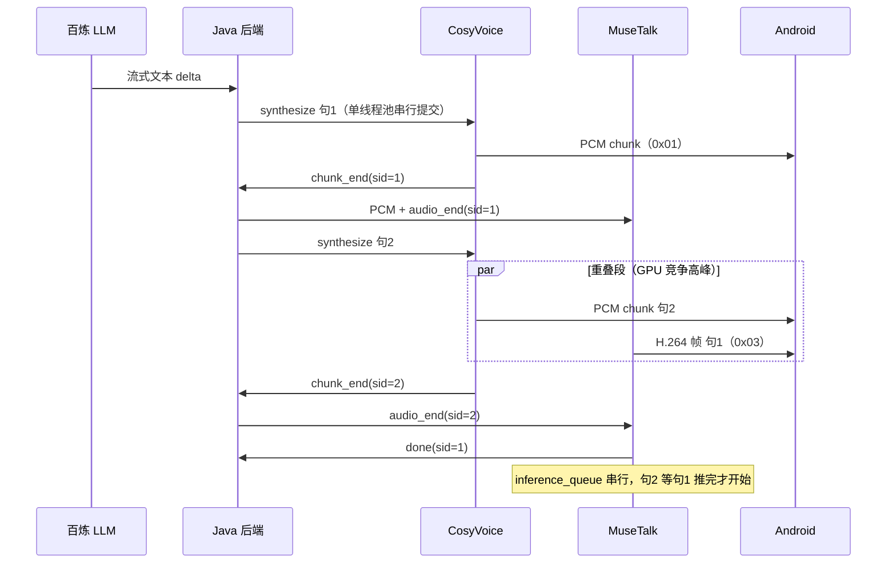

# MuseTalk GPU 推理性能与架构现状

> 范围：AutoDL RTX 5090 32GB 实例上，CosyVoice（TTS）+ MuseTalk（数字人视频）双服务同卡运行。
> 状态：基于代码审查 + `nvidia-smi dmon` 实测（CosyVoice 连续多句 + MuseTalk 同步推理）。
> 日期：2026-06-08

---

## 一、结论摘要

| 维度 | 现状 | 判断 |
|---|---|---|
| 句间推理 | MuseTalk / CosyVoice 均为单队列 + 全局锁，**严格串行** | 软件架构限制，非 GPU 限制 |
| 句内推理 | MuseTalk 按 `BATCH=32` 分批，双 CUDA Stream 流水线 | 句内有优化，但不改变句间串行 |
| GPU 算力（5090） | 双服务同时跑时 sm% 脉冲式（峰值 100%，平均约 30–50%） | **单用户够用，有余量但不宽裕** |
| 显存（5090 32GB） | 双服务常驻约 16–18GB，句末临时显存释放约 1GB | **显存不是瓶颈** |
| 并行推理可行性 | 显存够；算力有空档但多为 CPU/队列气泡 | **单用户不建议双路 MuseTalk 并行** |
| 真正瓶颈 | 串行队列 + CPU 侧空档（Whisper、libx264） | 优先流水线重叠，而非加并行实例 |

---

## 二、系统架构与数据流

### 2.1 部署拓扑

```
┌─────────────────────────────────────────────────────────┐
│              AutoDL RTX 5090 32GB（同卡）                 │
│                                                         │
│  ┌─────────────────────┐   ┌─────────────────────────┐ │
│  │ CosyVoice :6008     │   │ MuseTalk :6006          │ │
│  │ /ws/tts             │   │ /ws/infer               │ │
│  │ CosyVoice3 fp16     │   │ UNet + VAE + Whisper    │ │
│  │ ~3-4GB 显存         │   │ ~4-6GB 显存 + avatar    │ │
│  └──────────┬──────────┘   └────────────┬────────────┘ │
│             │         共享 GPU           │              │
└─────────────┼────────────────────────────┼──────────────┘
              │                            │
              └──────── Java 后端中继 ──────┘
                          │
                    Android 客户端
```

参考：`docs/产品部署文档.md` — 推荐配置为 5090 32GB 同实例运行两服务，合计约 12–16GB 显存。

### 2.2 单用户多句对话时序



**关键重叠段**：句 N 的 MuseTalk 视频推理 与 句 N+1 的 CosyVoice TTS 合成 **同时进行**，两者在同一张 5090 上交替抢占 SM 算力。这是 GPU 压力最大的时段。

---

## 三、推理串行机制（代码层面）

### 3.1 MuseTalk：句间严格串行

文件：`MuseTalk/api/ws_routes.py`

| 机制 | 实现 | 效果 |
|---|---|---|
| 任务队列 | `asyncio.Queue`（`inference_queue`） | 每句 `audio_end` 入队，单 worker 消费 |
| 全局锁 | `async with engine._lock` | 整句推理（生成帧 + H.264 编码 + 发包）互斥 |
| 完成信号 | `{"type": "done", "sentence_id": N}` | 句 N 全部推完后才处理句 N+1 |
| 中断 | `interrupt` 清空队列 + `engine.cancel()` | 打断当前句，丢弃待推理任务 |

音频到达时可立即入队（网络监听不阻塞），但 **GPU 推理不会提前开始**。

### 3.2 CosyVoice：句间严格串行

文件：`SoVITS/api/tts_routes.py`、`SoVITS/services/cosyvoice_engine.py`

| 机制 | 实现 | 效果 |
|---|---|---|
| 任务队列 | `job_queue` + 单 `worker()` | 等当前句 `synthesize_one` 完成才取下一句 |
| GPU 锁 | `_gpu_lock`（`threading.Lock`） | CosyVoice 模型非线程安全，GPU 调用互斥 |
| Java 侧 | `ctx.getTtsExecutor()` 单线程池 | 每用户 TTS 请求串行提交 |

### 3.3 MuseTalk：句内流水线（非句间并行）

文件：`MuseTalk/services/musetalk_engine.py`

| 参数 / 优化 | 值 / 说明 |
|---|---|
| 输出分辨率 | 480 × 854（竖屏约 480p） |
| 批大小 | `BATCH = 32`（≈ 1.28 秒视频 / 批） |
| 帧率 | 25 fps |
| 精度 | fp16 + TF32 |
| UNet / VAE | `torch.compile(mode="reduce-overhead")` |
| 双 Stream | 默认流跑 UNet，`post_stream` 跑 blend，batch 间重叠 |
| TeaCache | 音频 embedding 相似度 ≥ 0.97 时跳过 UNet |
| 音频特征 | Whisper-tiny，`audio2feat` 在 CPU 线程池 |
| 视频编码 | libx264（CPU，PyAV），每帧 CUDA → numpy → 编码 |

---

## 四、资源消耗画像

### 4.1 GPU 算力

**MuseTalk 单句推理链路**：

```
PCM → Whisper audio2feat（CPU）→ UNet（GPU 重）→ VAE decode（GPU）→ GPU blend → libx264（CPU）→ WebSocket
```

**实时性判据**：

- 目标：25 fps，每 40ms 一帧
- 每批 32 帧 ≈ 1.28 秒视频；若单批耗时 < 1280ms → 实时
- 实时倍率 = 音频时长 / 推理耗时；> 1.5x 表示单路宽裕

**双服务同跑时的 GPU 行为**（实测特征）：

- `sm %` 脉冲式：0% → 40–72% → **100%** → 12–25% → 再 100% → 0%
- 峰值 100%：TTS 与 MuseTalk 在同一时刻争抢 SM
- 低谷 12–25%：两边均不在跑重 kernel（TTS 等 token、MuseTalk 等 Whisper/H.264/发包）
- `enc/dec` 全程 0%：H.264 走 CPU `libx264`，未用 NVENC/NVDEC

### 4.2 显存（VRAM）

| 组件 | 估算占用 |
|---|---|
| CosyVoice3（fp16） | ~3–4 GB |
| MuseTalk UNet + VAE | ~4–6 GB |
| Avatar 底模（每景点，`load_avatar` 后常驻） | ~0.5–2 GB（视底模视频帧数） |
| 推理峰值（batch=32 激活张量） | ~1–3 GB（句末释放） |

Avatar 加载时日志示例（`musetalk_engine.py`）：

```
✅ 景点 {id} 预处理完成！有效帧={N}，循环长度={L}，GPU 占用≈{X.XX} GB
```

`nvidia-smi` 的 `fb` 为**整卡所有进程之和**（两 Python 进程 + PyTorch caching allocator）。

### 4.3 CPU / 系统内存

- **libx264**：25fps 逐帧编码，D2H + CPU 编码，是 GPU 空档的主要来源之一
- **Whisper-tiny**：`audio2feat` 在线程池，与 GPU 部分重叠
- **Avatar 预处理**：OpenCV、人脸解析等，加载时吃 CPU/RAM

---

## 五、5090 实测数据解读

> 采集命令：`nvidia-smi dmon -s pucvmet -d 1`
> 场景：CosyVoice 连续合成多句 + MuseTalk 同步推理（完整对话链路）

### 5.1 低负载瞬间（句间空档）

| 指标 | 观测值 | 解读 |
|---|---|---|
| `sm %` | ~23–32%，随后 → 0% | 一句推完后的空档 |
| `fb` | ~8739 MB（较活跃时下降约 1GB） | 推理临时显存释放，模型仍常驻 |
| `pwr` | ~165–170W → ~68W | 负载快速回落 |

### 5.2 高负载重叠段（TTS + 视频同时进行）

| 指标 | 观测值 | 解读 |
|---|---|---|
| `sm %` | 脉冲 19–72% → **100%** → 12–25% → 再 **100%** → 0% | 双服务交替抢 SM，非持续满载 |
| `mem %` | 峰值 ~46% | 显存带宽有压力但有余量 |
| `fb` | 16251–17957 MB（约 16–18 GB） | 双服务常驻 + 推理峰值，符合预期 |
| `pwr` | 峰值 **335W**，空闲 **11–13W** | 峰值不低，平均利用率仍不高 |

### 5.3 实测结论

1. **5090 能稳住单用户连续多句对话**，未出现持续满载或 OOM。
2. GPU 是**脉冲式工作**，平均 sm% 约 30–50%，说明卡上有空档，但空档多为流水线气泡，不宜简单等同于「可再跑一路 UNet」。
3. 显存 16–18GB / 32GB，**显存不是瓶颈**。
4. 最吃 GPU 的时段是 **句 N 视频推理 ∥ 句 N+1 TTS 合成** 的重叠段。

---

## 六、并行推理可行性评估

### 6.1 三个判断维度

| 维度 | 单用户多句现状 | 能否再并行一路 MuseTalk |
|---|---|---|
| 软件架构 | 单队列 + 全局锁，强制串行 | 需改代码，非硬件问题 |
| GPU 算力 | 平均 sm% 30–50%，峰值 100% | 勉强够，但会增大句间延迟 |
| 显存 | 已用 16–18GB，剩余 ~14–16GB | 够用（+2–4GB 峰值激活） |

### 6.2 并行推理的阻碍（代码级）

即使 GPU 有空闲，以下状态也无法直接并行：

| 共享状态 | 位置 | 风险 |
|---|---|---|
| `engine._lock` | `MuseTalkEngine` | 全局推理互斥 |
| `inference_queue` 单 worker | `ws_routes.py` | 句子排队 |
| `avatar["current_idx"]` | 每景点底模帧索引 | 并行两句会抢帧 |
| `_tea_cache_audio/latents` | TeaCache 全局 | 跨句污染 |
| CosyVoice `_gpu_lock` | TTS 引擎 | TTS 本身也串行 |

### 6.3 建议

| 场景 | 建议 |
|---|---|
| 单用户连续对话 | **不做** MuseTalk 双路并行；优先流水线重叠 |
| 多用户同时对话 | 评估多 worker / 多实例，5090 约可支撑 2–3 路（需实测） |
| sm 重叠段长期 > 80% | 先优化单路（加大 BATCH、H.264 线程池），再考虑并行 |
| 显存 > 26GB | 禁止并行，减 avatar 帧数或拆卡 |

---

## 七、推荐优化方向（按性价比排序）

### 7.1 流水线重叠（推荐，风险低）

句 N 视频推理进行时，句 N+1 预先做 CPU 侧 `audio2feat`（不占 GPU）；句 N 快结束时再启动句 N+1 的 UNet。吃掉 sm 12–25% 的空档，无需双 UNet 同时跑。

### 7.2 加大 MuseTalk `BATCH`

将 `BATCH` 从 32 提升到 48 或 64（5090 显存通常可承受），提高单次 kernel 效率，减少 sm% 抖动。

### 7.3 H.264 编码独立线程池

`h264_encoder.py` 当前在推理协程内同步编码，GPU 需等待 CPU。挪到独立线程池可减少 batch 间空档。

### 7.4 性能日志（建议补充）

在 `ws_routes.py` 增加每句统计，便于量化而不依赖肉眼读 `dmon`：

- 推理总耗时 vs 音频时长（实时倍率）
- 每 batch 耗时
- `torch.cuda.max_memory_allocated()` 峰值
- `inference_queue.qsize()` 队列深度

### 7.5 监控命令备忘

```bash
# 持续监控 GPU 算力 / 显存 / 功耗
nvidia-smi dmon -s pucvmet -d 1

# 查看各进程显存占用
nvidia-smi --query-compute-apps=pid,process_name,used_memory --format=csv

# 每秒刷新汇总
watch -n 1 'nvidia-smi --query-gpu=utilization.gpu,memory.used,memory.total,power.draw --format=csv'
```

**判读标准**：

| 观测 | 含义 |
|---|---|
| `sm %` 持续 < 50% 且单路已实时 | 算力有余，可尝试流水线重叠 |
| `sm %` 持续 > 80% | 算力紧张，不宜并行 |
| `memory.used` 空闲 > 8GB | 显存够再开一路 |
| `memory.used` 空闲 < 4GB | 显存不足，禁止并行 |
| MuseTalk 日志队列持续积压 | 用户已感知串行瓶颈 |

---

## 八、相关文件索引

| 文件 | 说明 |
|---|---|
| `MuseTalk/api/ws_routes.py` | MuseTalk WS 推理入口、队列、锁、H.264 发包 |
| `MuseTalk/services/musetalk_engine.py` | 推理引擎、BATCH、双 Stream、TeaCache |
| `MuseTalk/utils/h264_encoder.py` | CPU libx264 流式编码 |
| `SoVITS/api/tts_routes.py` | CosyVoice WS、TTS 任务队列 |
| `SoVITS/services/cosyvoice_engine.py` | CosyVoice 引擎、GPU 锁 |
| `ai-digital-guide-backend/.../CosyVoiceConnector.java` | TTS ↔ MuseTalk 中继、`audio_end` 转发 |
| `ai-digital-guide-backend/.../AiChatService.java` | LLM 分句 → TTS 单线程池提交 |
| `docs/产品部署文档.md` | 5090 部署配置与显存估算 |

---

## 九、待验证项

- [ ] 在 `ws_routes.py` 补充性能日志后，量化单句实时倍率（目标 > 1.5x）
- [ ] 重叠段（句 N 视频 + 句 N+1 TTS）单独抓 30s `dmon`，记录 sm% 均值与 P95
- [ ] 测试 `BATCH=48/64` 对延迟与 sm% 的影响
- [ ] 多用户并发场景下的 GPU / 队列积压压测（若业务需要）
